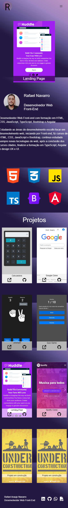

 
 <h1 align="center">Portfolio Website</h1>
<h2 align="center">Rafael Navarro | Front-End Developer </h2>

<a href="https://rafael0125.github.io/portfolio-v3/">Portfolio Website</a>
 

#### Tecnologias usadas no projeto

* Html 5
* CSS 3
* JavaScript
* Bootstrap

 

<h3 align="center"> Versão Desktop </h3>

<h3 align="center"> Versão Mobile </h3>

 
 
 

